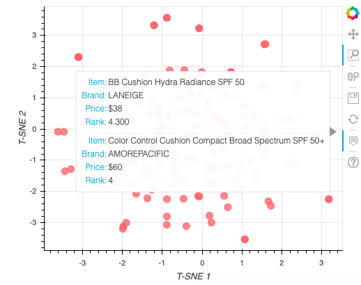

# Cosmetics Ingredients
Create a content-based recommendation system where the 'content' will be the chemical components of cosmetics. Process ingredient lists for 1472 cosmetics on Sephora via word embedding, then visualize ingredient similarity using a machine learning method, t-SNE and an interactive visualization library, Bokeh.

